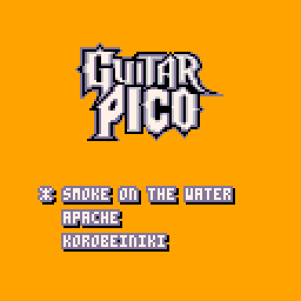
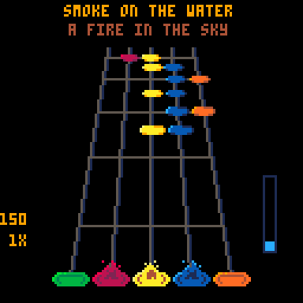

Two little projects for the [pico-8](https://www.lexaloffle.com/pico-8.php) fantasy retro console:

## Bad Apple

This is [Bad Apple](https://www.youtube.com/watch?v=FtutLA63Cp8), encoded
at 16x16 and 30fps.  It's based on JWinslow23's
[version](https://www.lexaloffle.com/bbs/?pid=62417#p) and borrows his
excellent music track.  I've used temporal compression to get 30fps
instead of the original 3.75fps.  The entire 3m17s video fits in 60KB of
code, or about 9 bytes per frame.  The compressor is included in the
source.

## Guitar Pico

It's a Guitar Hero clone.  It comes with three songs.  The fret keys are
`1`, `2`, `3`, `4`, and `5`.  On an arcade cabinet with an
[IPAC](https://www.ultimarc.com/control-interfaces/i-pacs/i-pac2/)
controller, the frets are `i`, `k`, `j`, `l`, `w`, whichever buttons you
have those wired to.  You can change the variable `arcade_scanmap` in
`gh.p8` to the [SDL
scancodes](https://github.com/libsdl-org/SDL/blob/main/include/SDL3/SDL_scancode.h)
for any other keys or mapped buttons you prefer.

